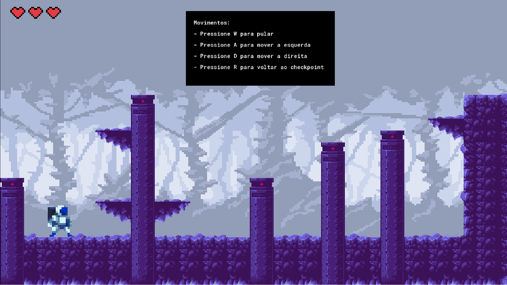

# Space Sprint

## Descrição

**Space Sprint** é um jogo de plataforma 2D onde o jogador controla um astronauta em um planeta hostil. O objetivo é superar os desafios em cada fase para encontrar o caminho de volta à sua nave. O jogador enfrentará obstáculos perigosos e inimigos alienígenas, utilizando apenas suas habilidades de movimentação para avançar pelas fases. Com controles simples e precisos, o jogo oferece uma experiência intensa em um ambiente extraterrestre.

## Como jogar o jogo

1. Baixe o arquivo do Space Sprint [aqui](https://www.mediafire.com/file/0gwz4i0n0i6zxgj/SPACE_SPRINT.exe/file)
2. Execute o arquivo como administrador.
3. Siga os passos do instalador.
4. Jogue! Use **A** e **D** para mover-se, e **W** para pular, e utilize **R** para reiniciar a fase e **ESC** para reiniciar o jogo.

## Gameplay

[Assista ao vídeo de gameplay](https://youtu.be/k-bqz5B9xl0)


## Tecnologias

- Game Maker Studio 2

## Como rodar o projeto

1. Clone o repositório:

    ```bash
    git clone https://github.com/Edson-Luiz/Space-Sprint.git
    ```

2. Abra o diretório:

    ```bash
    cd Space-Sprint
    ```

3. Abra o projeto utilizando o **Game Maker Studio 2**.

4. Execute o projeto.

## Tela

  


